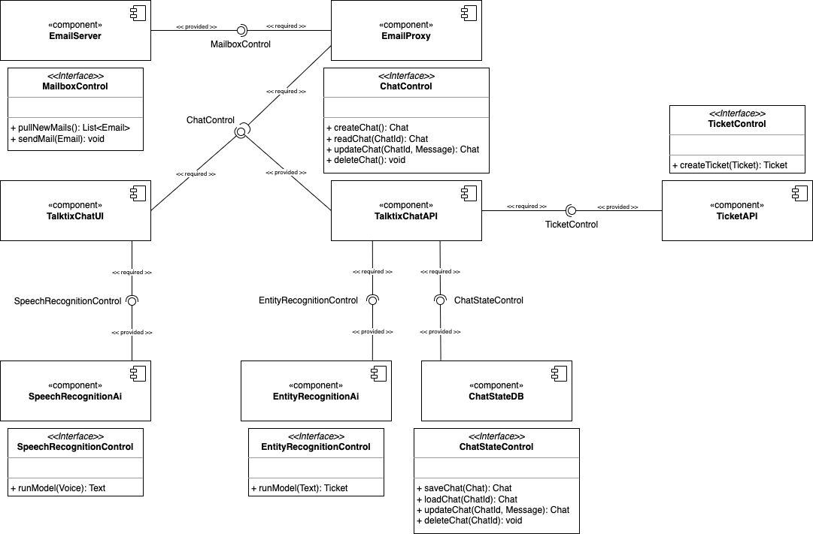
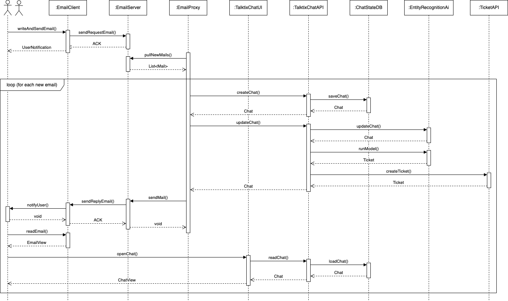

# Software Architecture

## Building Block View

### Whitebox Overall System

#### Contained Building Blocks

- TalktixChatUI: presents the chat to the user
- SpeechRecognitionAi: translates audio input into text
- TalktixChatAPI: defines endpoints of the backend
- EntityRecognitionAi: transforms the chat messages into a ticket
- ChatStateDB: stores the chat data
- TicketAPI: accepts tickets and is responsible for their processing
- EmailServer: manages email communication
- EmailProxy: opens a chat for received emails and replies via email

#### Important Components with Interfaces

## Runtime View

### Scenario 1: Creating a Ticket via Web App

### Scenario 2: Creating a Ticket via Email

## Technology Stack

### Frontend

- TypeScript
- Angular
- (Jest, Cypress)

### Backend

- Python
- FastAPI
- OpenAPI & Swagger
- PyMongo
- PyTorch
- NumPy
- Transformers by Hugging Face
- PyTest

## Realization View

## Architecture Decisions

### Microservices

The Microservice architecture of the backend has a low coupling between the single services and thus can be easily deployed and is highly reusable and able to experiment.

### Programming Languages

On the one hand, we decided to use Angular based on TypeScript as our framework for the frontend, because it is structured, modular, fast and delivers in-house solutions for common tasks. On the other hand, we chose FastAPI and PyTorch based on Python as our two frameworks for the implementation of the backend containing multiple APIs, data storage and artificial intelligence (Ai).

### Database

Chat and ticket data must be stored in a persistent database. We chose MongoDB, a document-based database which stores the data in an object-oriented way, because it's simple to maintain, easy to use and has a higher performance for simple CRUD operations than SQL databases.

### EmailService

Gmail is our email service provider delivering the EmailServer component.